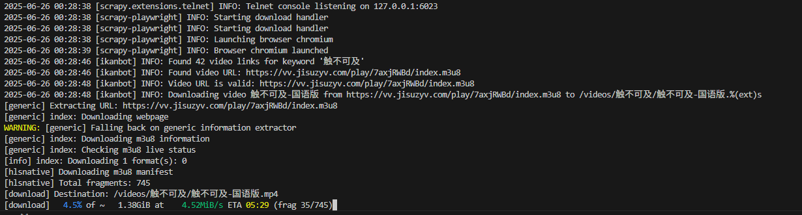

# 介绍
使用爬虫和yt-dlp下载视频，目前支持https://v.ikanbot.com/ 的视频下载(本程序仅用于学习参考，禁止用于违法行为)
## 环境要求
* Ubuntu操作系统（windows用户可用wsl创建）
* docker 24.07及以上版本
* 创建视频下载路径/videos
## 配置部署
### 安装git
```
apt-get update
apt-get install git -y
```
### 下载源码
```
git clone https://github.com/pengdake/pull-video.git
cd pull-video
```
### 制作容器镜像
```
docker build -t pull-video:latest .
```
### 启动docker-compose
```
docker-compose up -d
```

## 运行下载
### ikanbot爬虫
```
# 进入容器
docker exec -it pull-video bash
# 执行以下命令下载，keyword为视频名称，比如电影名
scrapy crawl ikanbot -a keyword="触不可及"
```
